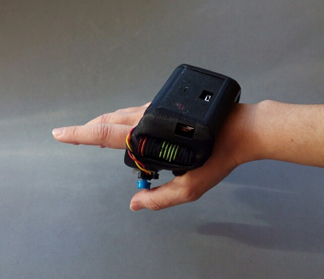
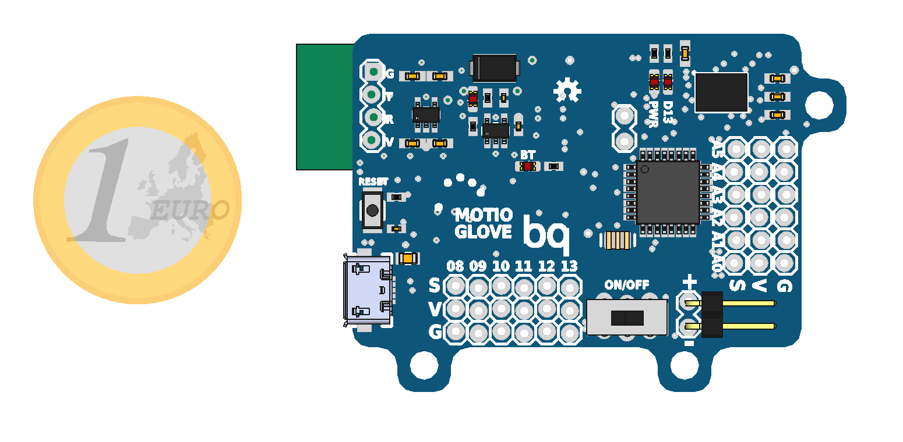

MotioGlove
===================================================================

<br;>
<br;>
MotioGlove is an inertial remote controller. The board mounts an Atmega328P working at 8Mhz and 3.3V, a BC-04 bluetooth module, a [BNO055 IMU](https://github.com/bqlabs/BNO055) and a 1-cell Lipo Charger. The USB to UART converter is a CH340, so its driver must be downloaded.

It has been used as a controller for [Loki](https://github.com/bqlabs/loki/tree/develop/loki), an omnidirectional robot, among others. Don't hesitate to contribute with your examples!

Attributions
--------------------------------------------------------------
 - [Alvaro Ferrán Cifuentes](https://linkedin.com/in/alvaroferran/en)
  - HW & SW design

- [Sonia Verdú ](http://www.soniaverdu.es/)
  - Mechanical design